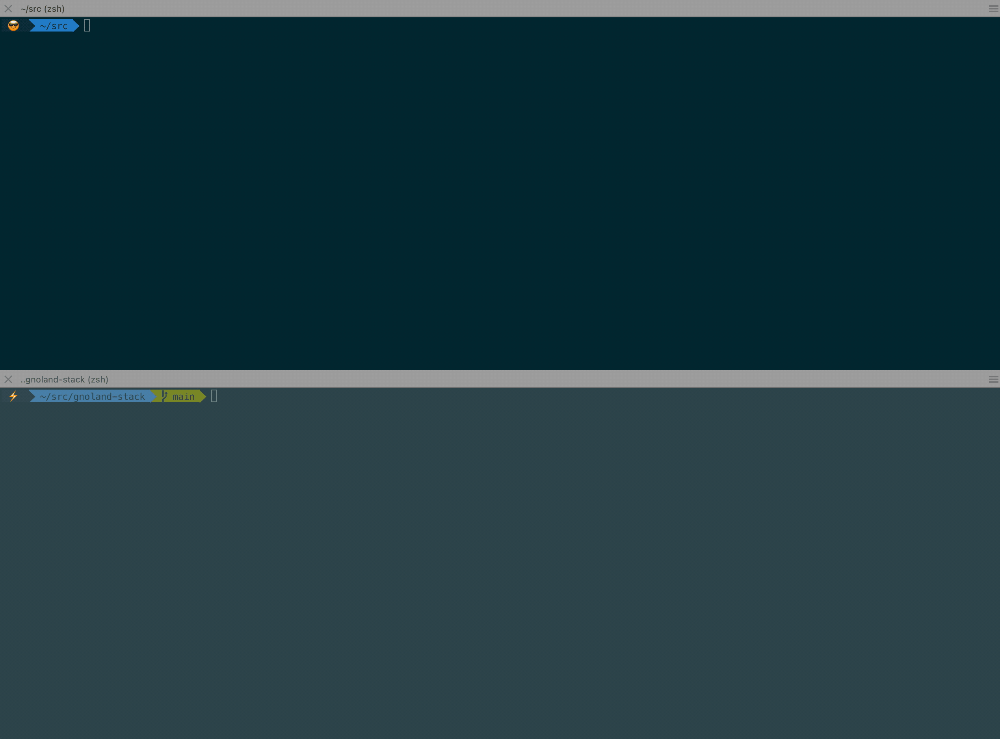
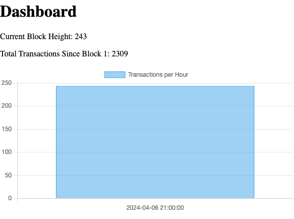

# gnoland-stack

This repo allows you to:
* start up a [gno.land blockchain node](https://github.com/gnolang/gno)
* start up a [transaction indexer](https://github.com/gnolang/tx-indexer)
* start a configurable recurring [supernova](https://github.com/gnolang/supernova) test simulating network activity
* Display various blockchain metrics on a dashboard https://github.com/orcutt989/gnoland-metrics

## Getting started
* [Install minikube](https://minikube.sigs.k8s.io/docs/start/#:~:text=1,Installation)
  * Nice local Kubernetes option
* [Install pulumi](https://www.pulumi.com/docs/install/)
  * Infrastructure as code
* [Install k9s](https://k9scli.io/topics/install/) and/or [kubectl](https://kubernetes.io/docs/tasks/tools/)
  * Allows you to interact visually with the Kubernetes cluster
* Perform these commands
  * `minikube start`
  * `cd gnoland-stack`
  * `pulumi up`
  * `k9s` (maybe in another terminal to watch)
  


## Access the dashboard

Forward the port for the gnoland-metrics service with kubectl

```bash
kubectl port-forward service/gnoland-metrics-service 8080:808
```

Browse to **http://localhost:8080/dashboard** in your browser

